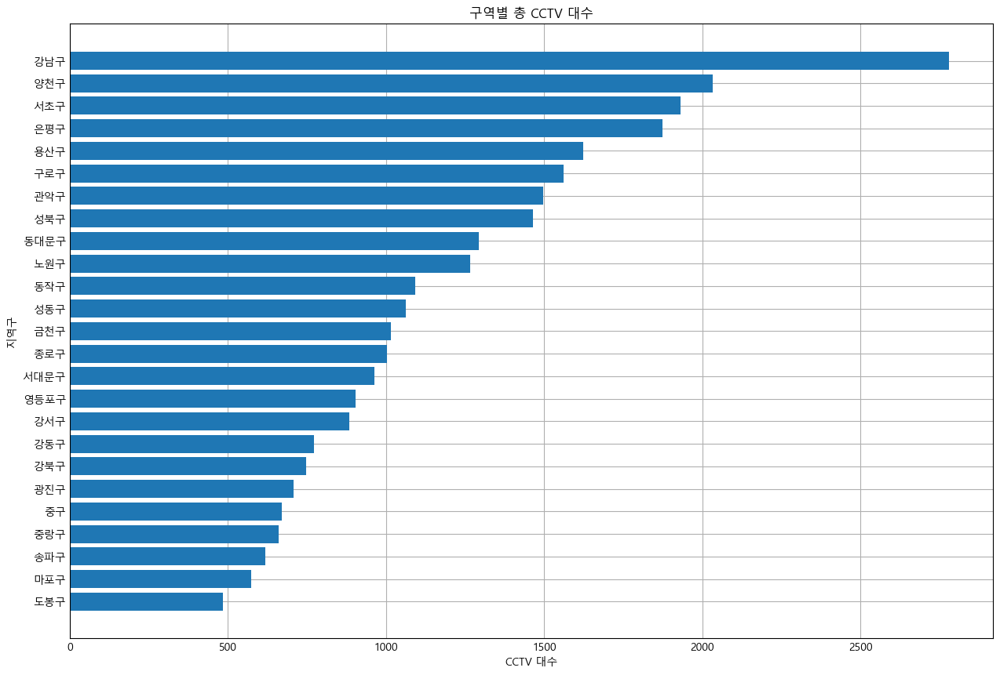
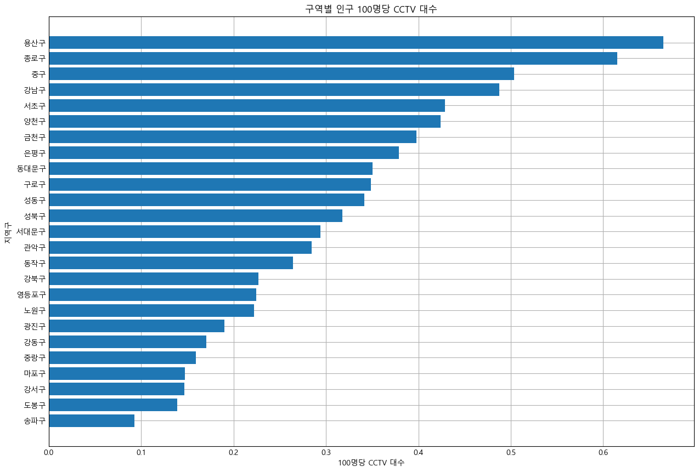
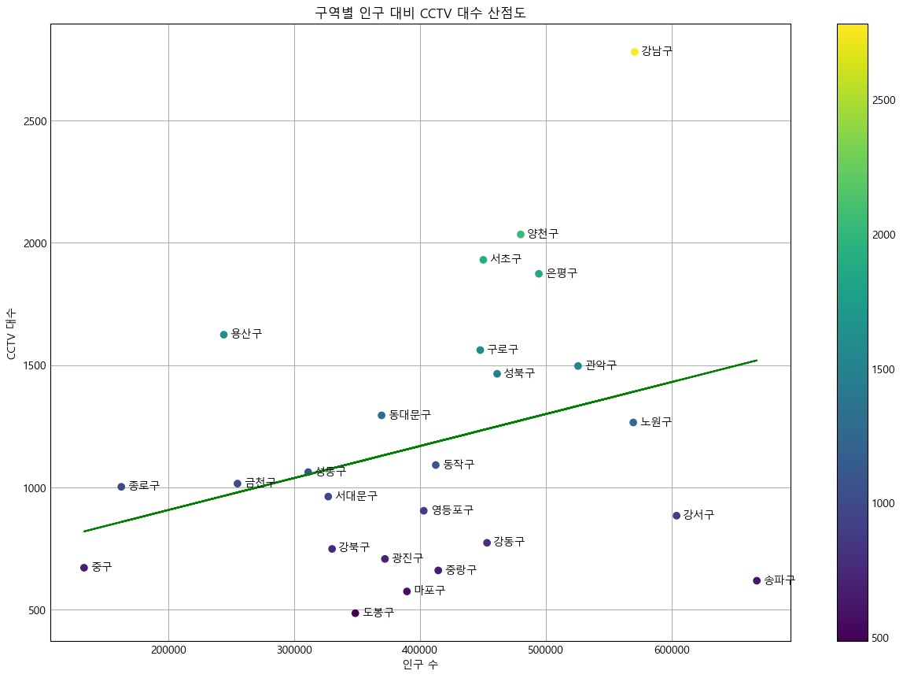

# 서울 지역구별 인구수와 CCTV 수의 관계

## 개요

numpy, pandas, matplotlib 를 이용해서 지역구별 인구와 CCTV의 관계 데이터를 시각화 한다

## 설명

### 데이터 전처리 과정

- 필요 없는 데이터를 버리고, 지역구별 CCTV 데이터와 인구 데이터를 합쳤다.

### 데이터 시각화

- 수평 막대 그래프로 지역구별 단순 CCTV 대수를 표현하였다.
- 단순 수치 비교를 위해 막대 그래프를 사용하였다.

- 수평 막대 그래프로 지역구별 인구 100명당 CCTV 대수를 표현하였다.
- 용산구가 인구수 대비 CCTV 대수가 가장 많은 것을 알 수 있다.

- 지역구별 인구 수를 x축으로, CCTV 대수를 y축으로 사용하는 산점도를 그렸다.
