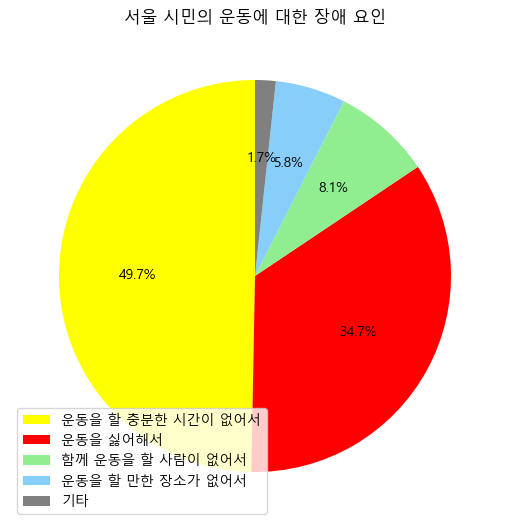
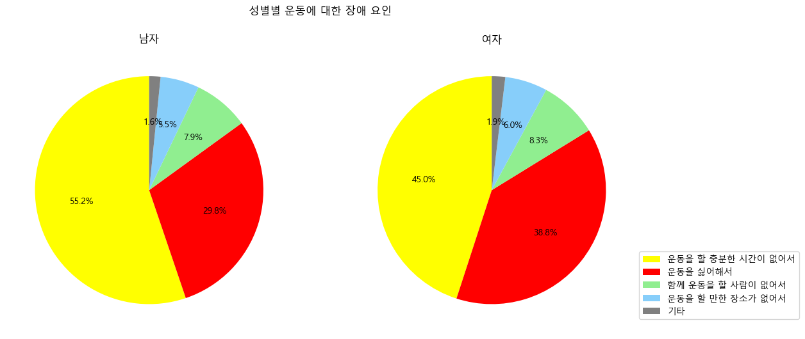
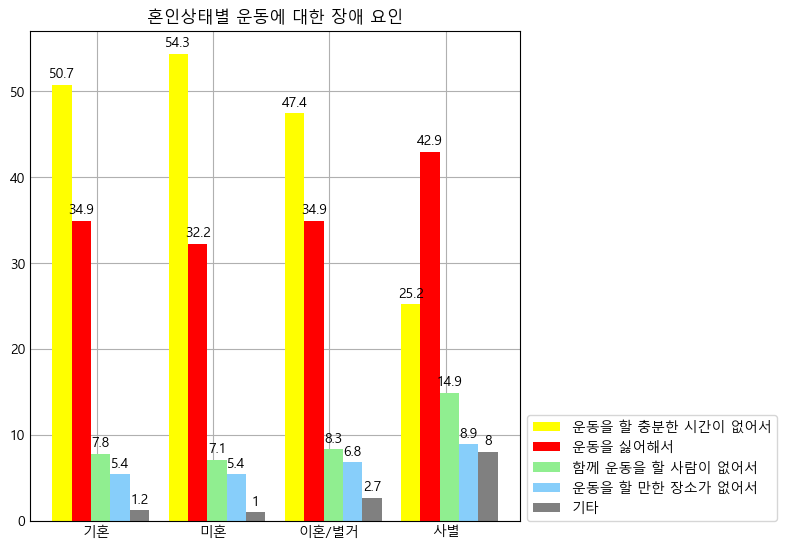
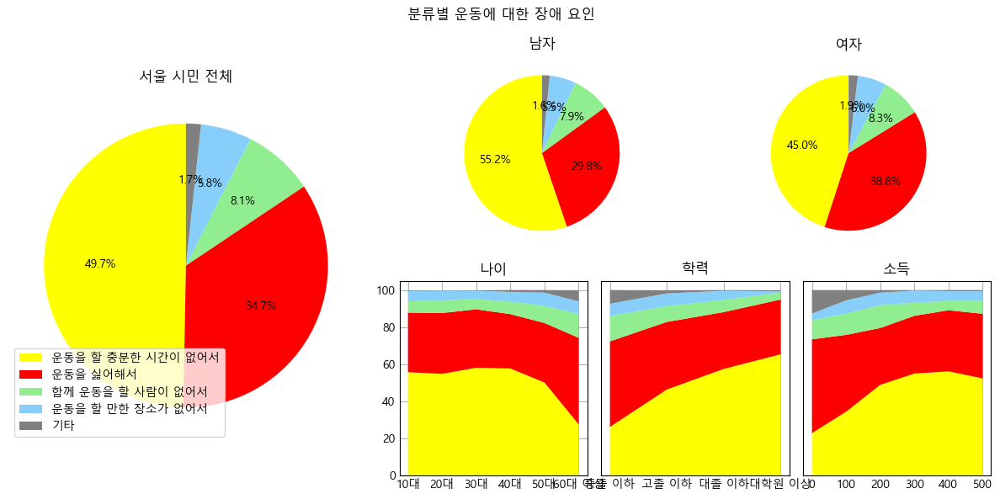

# 서울시 운동에 대한 장애 요인

## 개요

numpy, pandas, matplotlib 를 이용해서 사람들이 운동을 하지 않는 이유에 대한 데이터를 시각화 한다.

## 설명

### 데이터 전처리 과정

- 필요 없는 데이터를 버리고, 시각화 했을 때 보기 편하도록 column의 순서를 바꾸었다.

### 데이터 시각화

- 서울시 인구에 대한 운동하지 않는 이유의 비율을 그래프로 나타낸다.
- 각 항목당 응답한 비율을 잘 나타내기 위해 원 그래프를 사용하였다.

- 운동하지 않는 이유의 비율을 두 가지 성별로 각각 나타내었다.

- 위의 그래프를 띠 그래프 모양으로 다시 구성해보았다.

- 운동하지 않는 이유를 연령별, 학력별, 소득별로 비교하여 나타내었다.
- x축의 연령, 학력, 소득의 변화에 따른 수치 비교를 쉽게 하기 위해서 스택 그래프로 나타내었다.

- 운동하지 않는 이유를 기혼, 미혼, 이혼, 사별 등의 구분으로 비교하여 나타내었다.
- 여러 데이터를 구분하기 편하도록 그룹 막대 그래프로 나타내었다.

- 운동하지 않는 이유를 지역별로 비교해서 나타내었다.
- 히트맵으로 나타내어 비교했다.

- 위의 모든 그래프를 한 번에 표현하기 위해 gridspec을 사용하여 subplot을 나누었다.
